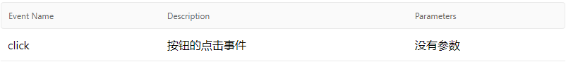
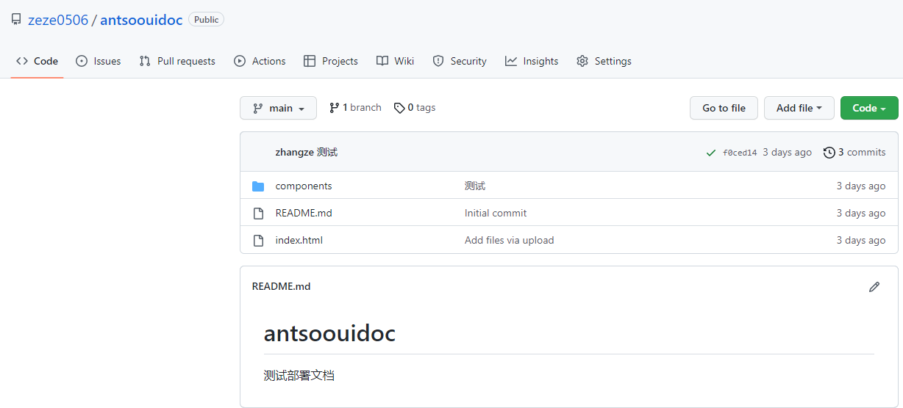

# 这是antsoo-ui组件库的文档项目
## 使用vuese通过注释自动生成文档
### 安装vuese
1、全局安装vuese/cli：

	npm i -g @vuese/cli
	
2、根据目录结构生成对应结构的markdown文件，存放在生成的website文件夹里：

	vuese gen
	
3、（可选）用生成的文件在本地部署一个服务器：

	vuese serve 
	
	同时打开浏览器：
	
	vuese serve --open
### 编写文档
1、	组件的描述

作为文档，你应该使用一句话向使用者介绍组件的用途。只需要在组件定义上添加一行普通的前导注释即可，如下：

    //这是组件的描述
    export default {
        ...
    }

    
2、	Props

在参数定义上添加注释来描述参数：

    // 按钮类型，空心
    hollow: {
        type: Boolean,
        default: false
    },
 

通过前导注释明确传参选项：

    // 按钮类型，空心
    hollow: {
        // 可以是`'true'` 也可以是`'false'`
        type: Boolean,
        default: false
    },
    
 
    
通过给 default 属性添加前导注释来自定义默认值：

    hollow: {
        // 可以是`'true'` 也可以是`'false'`
        type: Boolean,
        //默认值是：`自定义false`
        default: false
    },

 

3、	Slots

为插槽和默认插槽内容添加前导注释来增加描述，name会自动更新：
	 
    <!-- Form header -->
    <slot name="header">
        <!-- `<th>title</th>` -->
        <th>title</th>
    </slot>

 
   
4、	Events

添加前导注释来描述，使用 @arg 来对回调参数进行注解：

    click() {
        //按钮的点击事件
        //@arg 没有参数
        this.$emit("click");
    }

 

5、	分组

组件定义添加 @group [groupName] 前导注释即可：

    //@group GroupA
    export default {
        ...
    }

 

其他文档规则参考https://vuese.github.io/website/zh/cli/

## 在GITHUB上部署VUESE生成的文档
1、在github上注册一个账号，然后新建一个项目用来存放vuese生成的静态资源（注意！此项目仅为部署文档静态页面而存在，并非组件库项目！）
 
 

2、把项目拉下来，然后把vuese生成的website文件夹下的所有文件推到刚才在github上创建的项目里
  
 

3、在settings里找到pages，选择需要展示的分支，点击save保存
  
 

4、等待几分钟让github部署，之后就可以通过访问 你的github用户名.github.io/项目名来打开文档，这里用我的来举例：
  
 

6、	在settings里找到collaborators，点击Add People，输入成员的github用户名，来给成员更新这个文档的权限。
  
 

7、拉取组件库项目，生成最新的文档静态页面website，然后把website里的所有东西丢到这个项目里，push上去，即可跟新文档

   

